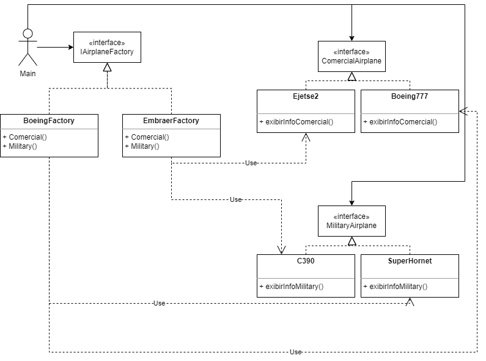
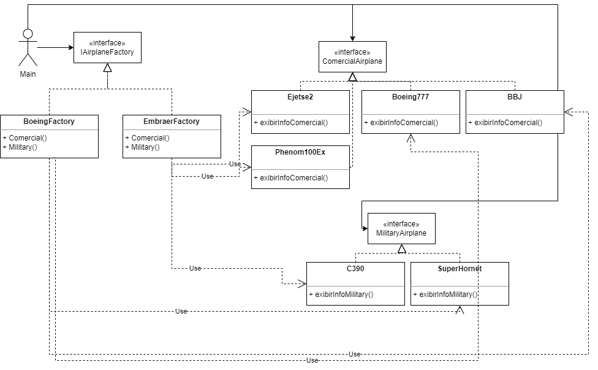

# Projeto de Padrões de Projeto

Implementação do Abstract Factory Pattern + Diagramas UML

### Autores

- [@brunobatistabbf](https://www.github.com/brunobatistabbf)

## Funcionalidades

- O Abstract Factory é um padrão de projeto criacional que permite que você produza famílias de objetos relacionados sem ter que especificar suas classes concretas.

## Diagramas

### Diagrama 1

#

### Diagrama 2

#

### Diagrama 3
### Diagrama 4